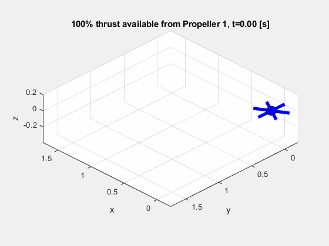
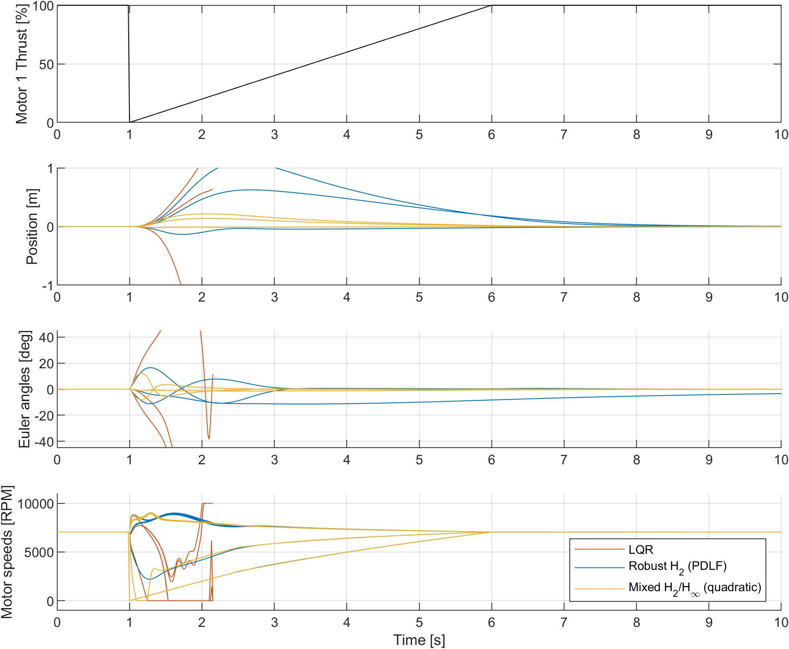

# Robust LQR for a Hexacopter Under Motor Failure

Design of a fault-tolerant flight controller: synthesise a single state-feedback gain $u=-Kx$ that stabilises a hexacopter, both in *nominal* flight and under *failure* conditions, with no fault detection or controller switching allowed/required. The failure considered: complete loss of thrust in any one motor, possibly instantaneous, with a slow-but-guaranteed recovery of thrust.

The key artefact is `dlqr_multiplant.m` — `dlqr` for the multiplant case (Guaranteed Cost Control). Pass in a set of plants $\{(A,B)\}$ and your usual $Q$ and $R$ weights; get back a single state-feedback gain $K$ with a guaranteed H₂ cost across the entire set — or a certificate that no such gain exists.[^1] The hexacopter is the demonstration, but the function is general.

[^1]: Strictly speaking: none satisfying these (sufficient) LMI conditions, which carry some conservatism.

<div align="center">
<table>
  <tr>
    <th width="50%" style="text-align:center">Nominal LQR controller K₀</th>
    <th width="50%" style="text-align:center">Robust LQR controller Kᵣ</th>
  </tr>
  <tr>
    <td width="50%" style="text-align:center">
      <br>
      &nbsp;
    </td>
    <td width="50%" style="text-align:center">
      <br>
      (See the <a href="plots/animation_Kr.mp4">mp4</a> animation for better quality)
    </td>
  </tr>
</table>
</div>

*Both simulations above use the full nonlinear dynamics with ZOH. Motor 1 loses all thrust at t = 1 s and recovers linearly over the next 5 s. The nominal LQR controller K₀ destabilises; the robust controller Kᵣ rides out the failure.*

## The problem

An LQR controller designed for the nominal hexacopter dynamics has good inherent robustness... but a motor failure is not a small perturbation. Losing a rotor changes the input matrix $B$ structurally (the control allocation, the effective actuator authority - all now wrong, and possibly time-varying) - and the hover equilibrium also shifts, adding another unmodelled disturbance to contend with.

Simulated against the nonlinear model with one motor out, the nominal gain K₀ loses the aircraft.

## The approach

Rather than detecting the fault and switching controllers (which may not be reliable or timely enough), a single *robust gain* Kᵣ is designed — guaranteed by design to stabilise across the full set of operating conditions, and optimising an LQR-like performance index across the set (Guaranteed Cost Control):

1. **Model the failure set.** The dynamics are linearised about hover for seven scenarios: all motors healthy, plus each of the six single-motor-out cases. Each failure case uses its own trim solution — the equilibrium rotor speeds are recomputed with the failed motor's opposite held at nominal RPM, avoiding the degenerate least-squares solution that shuts down the opposite motor entirely.
2. **Synthesise over the vertex set.** The robust gain is found by solving the extended-H₂ LMI of de Oliveira, Geromel & Bernussou (2002), using parameter-dependent Lyapunov functions across the seven (A,B) vertices. This is a convex program, solved here with YALMIP + MOSEK in well under a second - non-trivial, since the gain being optimised is $K\in\mathbb{R}^{6\times12}$, optimised across a set of 7 plants with each $A_i\in\mathbb{R}^{12\times12}$ and $B_i\in\mathbb{R}^{12\times6}$.
3. **Validate on the nonlinear model.** Kᵣ is tested against the full nonlinear dynamics with time-varying thrust loss — including scenarios it was never explicitly designed for (partial thrust loss, thrust recovery mid-flight — being a convex program, these are conveniently accounted for without explicit consideration).

The cost matrices $Q$ and $R$ are chosen via Bryson's rule from allowable state deviations and the rotors' RPM headroom, and the nominal response under Kᵣ remains close to that of K₀. The price of robustness shows up mainly as a slow yaw mode under motor failure — a consequence of reduced yaw controllability with a rotor out, and the motivation for the follow-up design below (see *Further work*).

## The notebook

The design process lives in [`notebook.mlx`](notebook.mlx) (or [read it in the browser](notebook.md)). It walks through:

- Nonlinear hexacopter dynamics and motor mixing
- Linearisation about hover and discretisation (100 Hz)
- Nominal LQR design and closed-loop validation
- Simulated motor failure: why K₀ fails
- Failure-scenario modelling and trim computation
- Robust synthesis via the LMI, and validation of Kᵣ
- Summary, future work (mixed H₂/H∞ design).

## Requirements

- MATLAB (with Live Editor for the `.mlx`)
- Control System Toolbox (`dlqr`, `c2d`)
- [YALMIP](https://yalmip.github.io/)
- [MOSEK](https://www.mosek.com/) (free academic licences available). Any YALMIP-compatible SDP solver such as SeDuMi or SDPT3 should also work — change the solver in `sdpsettings` inside `dlqr_multiplant.m`.

## Running it

Open `notebook.mlx` in MATLAB with the repository root on the path, and run it top to bottom. The notebook is the entry point — the simulation and model-related functions (`run_sim`, `get_A_matrix`, `get_B_matrix`, ...) are all found in `/plant/`. Visual renders of the trajectories can be generated using the animation scripts found in `/plots/`. Feel free to experiment with outage scenarios, model parameters, cost matrices, and so forth.

```
├── notebook.mlx / notebook.md                     Main design notebook (entry point)
├── setup.m                                        Adds project folders to the MATLAB path
├── dlqr_multiplant.m                              Robust LQR synthesis (YALMIP, MOSEK)
├── plant/                                         Dynamics, linearisation, trim, and simulation functions
└── plots/                                         Animation scripts, renders
```

## Further work: mixed H₂/H∞ synthesis

*(Design complete; code not yet published to this repo.)*

The PDLF-based Kᵣ stabilises every failure scenario, but exhibits a slow yaw mode under motor loss — a physical limitation of reduced yaw authority with a rotor out, which Q/R retuning could not resolve without degrading other channels. A follow-up design addresses this with a **mixed H₂/H∞ synthesis in a common quadratic Lyapunov framework**:

- When a motor fails, the vehicle is no longer at the design equilibrium — the trim shift acts as a *non-equilibrium input disturbance*, separate from the polytopic uncertainty. An H∞ constraint bounds the amplification of this input-channel disturbance into a Q-weighted state output, directly targeting the mechanism by which the fault degrades the response.
- The synthesis minimises the guaranteed H₂ cost subject to an H∞ budget (an ε-constraint scalarisation), giving a single explicit tuning knob between nominal performance and fault-transient robustness.
- A common quadratic Lyapunov function across all vertices (retaining the slack-variable parametrisation, but with shared Lyapunov matrices) certifies stability under **arbitrarily fast parameter variation** within the polytope — including the instantaneous onset of motor failure, which the frozen-parameter PDLF conditions do not directly address. The conservatism this introduces is the deliberate price of the guarantee.

<p align="center">
  
</p>

*Response to complete loss of Motor 1 thrust at t = 1 s (linear recovery over 5 s), full nonlinear simulation with ZOH and actuator constraints. Nominal LQR (red) destabilises. Robust H₂ via PDLF (blue) survives but shows large position disturbances and the slow yaw mode. The mixed H₂/H∞ design (yellow) keeps position excursions roughly 5× smaller and all states (including yaw) settle within a few seconds — at the cost of a ~2.5× higher nominal-plant H₂ cost than the PDLF design, a tradeoff set explicitly via the H∞ budget.*

## References

- M. C. de Oliveira, J. C. Geromel and J. Bernussou, "Extended H₂ and H∞ norm characterizations and controller parametrizations for discrete-time systems," *International Journal of Control*, vol. 75, no. 9, pp. 666–679, 2002. [doi:10.1080/00207170210140212](https://doi.org/10.1080/00207170210140212)