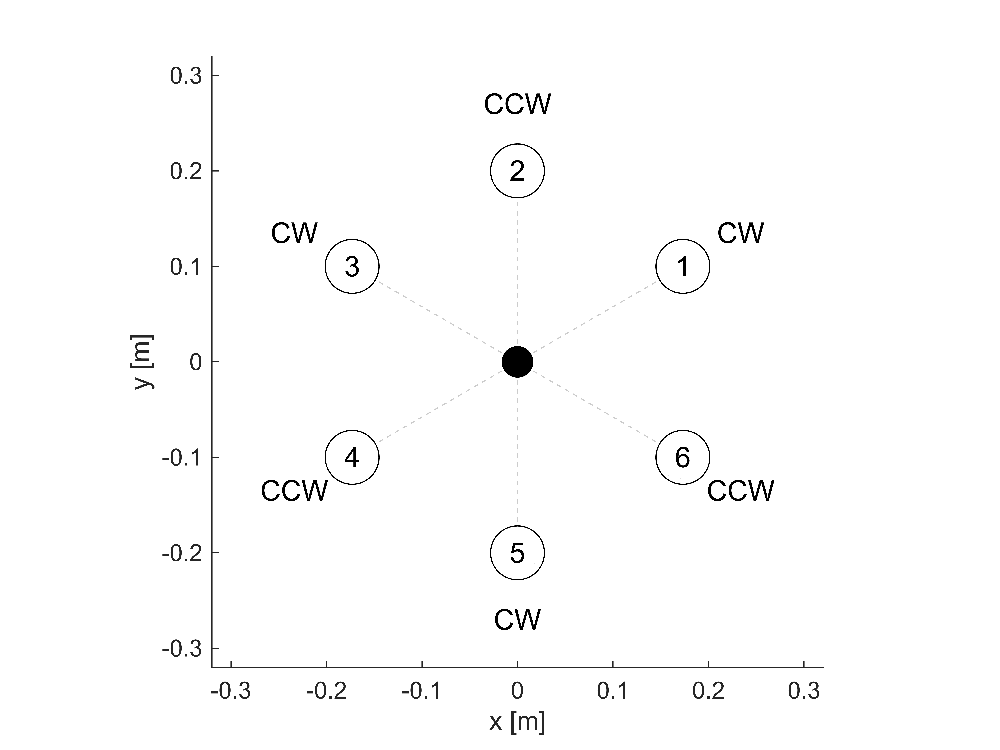
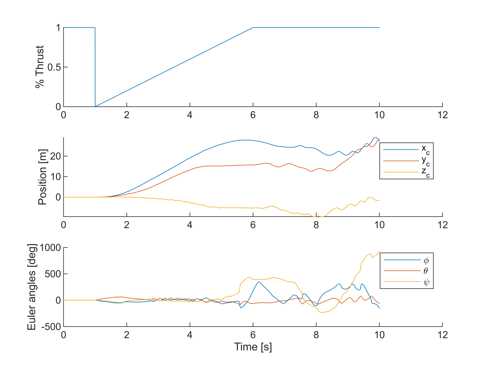
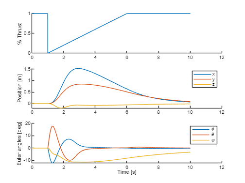
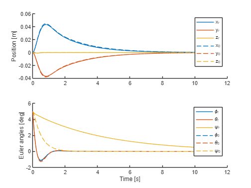
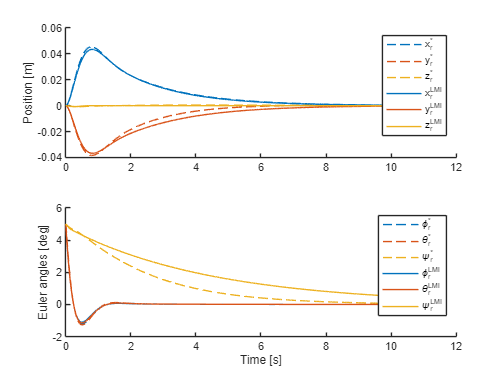

```matlab
clear
close all
load_copter_params
```

# Hexacopter Description

Show the x and y positions for each motor on the hexacopter, and indicate the CCW/CW\-rotating propellers.

```matlab
figure(1); clf; hold on; axis equal
xlabel('x [m]'); ylabel('y [m]')
xlim([-qp.l qp.l]*1.6); ylim([-qp.l qp.l]*1.6);
for i=1:qp.n_rotors
    plot([0 qp.x(i)], [0 qp.y(i)],'--', 'Color',[1 1 1]*0.8)
    scatter(qp.x(i),qp.y(i),512,'MarkerEdgeColor','k','MarkerFaceColor','white')
    if qp.dirs(i) == 1
        label = 'CCW';
    elseif qp.dirs(i) == -1
        label = 'CW';
    end
    text(qp.x(i), qp.y(i), sprintf("%d", i), 'FontSize', 12, 'HorizontalAlignment', 'center', 'VerticalAlignment', 'middle');
    text(qp.x(i)*1.35, qp.y(i)*1.35, sprintf("%s", label), 'FontSize', 12, 'HorizontalAlignment', 'center', 'VerticalAlignment', 'middle');
end
scatter(0,0,2048,'k.')
```


# Nonlinear dynamics.

Each motor is assumed to produce a thrust force according to 

&nbsp;&nbsp;&nbsp;&nbsp; $$ F_i =k_F \omega_i^2 $$ 

as well as a moment due to air resistance

&nbsp;&nbsp;&nbsp;&nbsp; $$ M_i =\pm k_M \omega_i^2 $$ 

where the sign of $M_i$ depends on the motor's rotation direction (e.g. if the propeller is rotating CCW, a CW moment will be induced on the copter).


Compactly, this yields the following expression for the total force/torques produced by the motors:


&nbsp;&nbsp;&nbsp;&nbsp;&nbsp; $\left\lbrack \begin{array}{c} F_T \newline \tau_x \newline \tau_y \newline \tau_z  \end{array}\right\rbrack =M\left\lbrack \begin{array}{c} \omega_1^2 \newline \omega_2^2 \newline \vdots \newline \omega_6^2  \end{array}\right\rbrack$ where $M=\left\lbrack \begin{array}{cccc} k_F  & k_F  & ... & k_F \newline k_F (y_1 ) & k_F (y_2 ) & ... & k_F (y_6 )\newline k_F (-x_1 ) & k_F (-x_2 ) & ... & k_F (-x_6 )\newline k_M  & -k_M  & ... & -k_M  \end{array}\right\rbrack$ .


The nonlinear dynamics used to simulate the hexacopter trajectory are the standard equations of motion (Euler's equation + Euler rate dynamics)

&nbsp;&nbsp;&nbsp;&nbsp; $$ {\dot{x} }_I =C_{Ib} v_c $$ 

&nbsp;&nbsp;&nbsp;&nbsp; $$ {\dot{v} }_c =-S(\omega )v_c +\frac{1}{m}\left(\left\lbrack \begin{array}{c} 0\newline 0\newline F_t  \end{array}\right\rbrack +C_{bI} \left\lbrack \begin{array}{c} 0\newline 0\newline -mg \end{array}\right\rbrack \right) $$ 

&nbsp;&nbsp;&nbsp;&nbsp; $$ \dot{\omega} =-{\mathbb{I}}^{-1} S(\omega )\mathbb{I}\omega +{\mathbb{I}}^{-1} T_c $$ 

&nbsp;&nbsp;&nbsp;&nbsp; $$ \left\lbrack \begin{array}{c} \dot{\phi} \newline \dot{\theta} \newline \dot{\psi}  \end{array}\right\rbrack =\left\lbrack \begin{array}{ccc} 1 & \sin \phi \tan \theta  & \cos \phi \tan \theta \newline 0 & \cos \phi  & -\sin \phi \newline 0 & \sin \phi \sec \theta  & \cos \phi \sec \theta  \end{array}\right\rbrack \left\lbrack \begin{array}{c} \phi \newline \theta \newline \psi  \end{array}\right\rbrack $$ 

where


&nbsp;&nbsp;&nbsp;&nbsp;&nbsp; ${\dot{x} }_I$ is the hexacopter's xyz position, as measured in the *inertial* frame,


&nbsp;&nbsp;&nbsp;&nbsp;&nbsp; ${\dot{v} }_c$ is the hexacopter's xyz velocity, as measured in the *body* frame,


&nbsp;&nbsp;&nbsp;&nbsp;&nbsp; $\dot{\omega}$ is the hexacopter's angular velocity, as measured in the *body* frame,


&nbsp;&nbsp;&nbsp;&nbsp;&nbsp; $\phi ,\theta ,\psi$ are the Euler angles describing the hexacopter's orientation: the DCM from the inertial frame to the *body* frame is $C_{bI} =C_x (\phi )C_y (\theta )C_z (\psi )$ ,


&nbsp;&nbsp;&nbsp;&nbsp;&nbsp; $F_t$ and $T_C =\left\lbrack \begin{array}{c} \tau_x \newline \tau_y \newline \tau_z  \end{array}\right\rbrack$ describes the force/torques produced by the hexacopter motors, measured in the *body* frame.


Aerodynamic drag on the hexacopter body is not included \- since there are no aerodynamic lifting surfaces, we assume this is negligible.

# Linear dynamics $\dot{x} =Ax+Bu$ .

Linearised about the hover equilibrium, we have


 $\begin{array}{l} {\dot{x} }_I \approx v_{c_x } \newline {\dot{y} }_I \approx v_{c_y } \newline {\dot{z} }_I \approx v_{c_z } \newline  \end{array}$           $\begin{array}{l} {\dot{v} }_{c_x } \approx g\theta \newline {\dot{v} }_{c_y } \approx -g\phi \newline {\dot{v} }_{c_z } \approx \frac{1}{m}\delta_{F_t } \newline  \end{array}$        $\begin{array}{l} \dot{\phi} \approx \omega_x \newline \dot{\theta} \approx \omega_y \newline \dot{\psi} \approx \omega_z  \end{array}$         $\begin{array}{l} {\dot{\omega} }_x \approx \tau_x /I_{xx} \newline {\dot{\omega} }_y \approx \tau_y /I_{yy} \newline {\dot{\omega} }_z \approx \tau_z /I_{zz} \newline  \end{array}$ .


The state space dynamics $\dot{x} =Ax+Bu$ are formed using the state vector


&nbsp;&nbsp;&nbsp;&nbsp;&nbsp; $x={\left\lbrack \begin{array}{ccccccccccccc} x_I  & y_I  & z_I  & v_{c_x }  & v_{c_y }  & v_{c_z }  & \phi  & \theta  & \psi  & \omega_x  & \omega_y  & \omega_z  &  \end{array}\right\rbrack }^{\top }$ .

## State matrix $A$ .
```matlab
% Construct A matrix (continous time)
A = zeros(12);

% Position kinematics
A(1,4) = 1;   % dx/dt = v_c_x
A(2,5) = 1;   % dy/dt = v_c_y
A(3,6) = 1;   % dz/dt = v_c_z

% Translational acceleration
g = 9.81;
A(4,8) =  g;  % ẍ_c ≈  g * theta
A(5,7) = -g;  % ÿ_c ≈ -g * phi

% Angular kinematics
A(7,10) = 1;  % dϕ/dt = ω_x
A(8,11) = 1;  % dθ/dt = ω_y
A(9,12) = 1;  % dψ/dt = ω_z
```
## Input matrix $B$ .
### Linearising the motor mixing matrix $M$ .

Consider the first motor's thrust, $F_1 =k_F \omega_1^2$ . Suppose at equilibrium the motor has rotational velocity ${\bar{\omega} }_1$ .


Then $F_1 \approx k_F {{\bar{\omega} }_1 }^2 +2k_F {\bar{\omega} }_1 \delta_{\omega_1 }$ i.e. $\delta_{F_1 } \approx (2k_F {\bar{\omega} }_1 )\delta_{\omega_1 }$ .


Similarly, $\delta_{M_1 } \approx \pm (2k_M {\bar{\omega} }_1 )\delta_{\omega_1 }$ .


Across all motors for the hexacopter, we end up getting the following linearisation of the motor mixing matrix:


&nbsp;&nbsp;&nbsp;&nbsp;&nbsp; $\left\lbrack \begin{array}{c} \delta_{F_T } \newline \delta_{\tau_x } \newline \delta_{\tau_y } \newline \delta_{\tau_z }  \end{array}\right\rbrack =M\left\lbrack \begin{array}{c} \delta_{\omega_1 } \newline \delta_{\omega_2 } \newline \vdots \newline \delta_{\omega_6 }  \end{array}\right\rbrack$  where $M=\left\lbrack \begin{array}{cccc} 2k_F {\bar{\omega} }_1  & 2k_F {\bar{\omega} }_2  & ... & 2k_F {\bar{\omega} }_6 \newline 2k_F {\bar{\omega} }_1 y_1  & 2k_F {\bar{\omega} }_2 y_2  & ... & 2k_F {\bar{\omega} }_6 y_6 \newline -2k_F {\bar{\omega} }_1 x_1  & -2k_F {\bar{\omega} }_2 x_2  & ... & -2k_F {\bar{\omega} }_6 x_6 \newline 2k_M {\bar{\omega} }_1  & -2k_M {\bar{\omega} }_2  & ... & -2k_M {\bar{\omega} }_6  \end{array}\right\rbrack$ 

### Combining with linear dynamics.
```matlab
% Construct B matrix (continuous time)
M = compute_M(qp);
B = zeros(12,qp.n_rotors);
B(6,:)  = (1/qp.m)    * M(1,:);  % z_c_ddot = F_t / m
B(10,:) = (1/qp.I_xx) * M(2,:);  % ω_x_dot  = τ_x / I_xx
B(11,:) = (1/qp.I_yy) * M(3,:);  % ω_y_dot  = τ_y / I_yy
B(12,:) = (1/qp.I_zz) * M(4,:);  % ω_z_dot  = τ_z / I_zz
```

# Design an LQR controller.

Assume we can implement a discrete time controller with an update frequency of 100Hz.

```matlab
qp.Ts = 1/100;
```

Use Bryson's rule to determine the cost matrices $Q,R$ .


Recall the the state vector ordering is:

&nbsp;&nbsp;&nbsp;&nbsp; $$ x={\left\lbrack \begin{array}{ccccccccccccc} x_I  & y_I  & z_I  & v_{c_x }  & v_{c_y }  & v_{c_z }  & \phi  & \theta  & \psi  & \omega_x  & \omega_y  & \omega_z  &  \end{array}\right\rbrack }^{\top } $$ 
```matlab
max_allowable_x = [[10 10 10]*0.01, ...  % Allowable xyz displacement, around 10cm
                   [5 5 5]*0.01, ...     % Allowable xyz velocities, around 5cm/s
                   deg2rad([5 5 5]), ... % Allowable Euler angles, around 5deg
                   deg2rad([5 5 10])];   % Allowable Euler rates, around 5 to 10deg/s

qp.nominal_omegas = compute_omega_bar(qp, ones(1,qp.n_rotors), 'least_squares');
max_omegas = ones(1,qp.n_rotors) * qp.max_RPM*2*pi/60;
max_delta_omegas = max_omegas - qp.nominal_omegas;
max_allowable_u = max_delta_omegas; % Allowable change in RPM: as determined by the copter's RPM headroom

Q = diag(1 ./ max_allowable_x.^2);
R = diag(1 ./ max_allowable_u.^2);

A_cts = get_A_matrix(); B_cts = get_B_matrix(qp);
sys_d = c2d(ss(A_cts, B_cts, eye(12), 0), qp.Ts, 'zoh');

K0 = -dlqr(sys_d.A, sys_d.B, Q, R); % Nominal controller
```
# Simulate the closed loop dynamics (nonlinear model with nominal controller $K_0$ ).

Let's test the hexacopter's response to a small initial condition (all Euler angles are 5 degrees initially).

```matlab
% Assess the LQR controller based on nominal model
qp.K = K0;
x0 = [0 0 0 0 0 0 deg2rad([5 5 5]) 0 0 0]';

% Define the function describing available thrust from motors 1-6
thrust_fcn = @(t) ones(1,qp.n_rotors); % all motors operating normally

% Run the simulation
tspan = [0 10];
[t,X] = run_sim(qp, tspan, x0, thrust_fcn);

% Draw plots
figure; clf

subplot(2,1,1); hold on
plot(t,X(:,1))
plot(t,X(:,2))
plot(t,X(:,3))
ylabel('Position [m]')
legend('x','y','z')

subplot(2,1,2); hold on
plot(t,X(:,7)*180/pi)
plot(t,X(:,8)*180/pi)
plot(t,X(:,9)*180/pi)
ylabel('Euler angles [deg]')
legend('\phi','\theta','\psi')

xlabel('Time [s]')
```


The hexacopter smoothly recovers to the origin. We will stick with these $Q$ and $R$ matrices for now \- the closed loop response is reasonable.

# Simulate the dynamics under motor failure (nonlinear model, nominal controller $K_0$ ).

Now, consider partial or full loss of thrust in Motor 1. Instead of $F_1 =k_F \omega_1^2$ , suppose we now have

&nbsp;&nbsp;&nbsp;&nbsp; $$ F_1 =ck_F \omega_1^2 $$ 

where $c\in [0,1]$ determines the percentage of available thrust. For example:


&nbsp;&nbsp;&nbsp;&nbsp;&nbsp; $c=0$ indicates complete loss of thrust  \- the motor has completely failed \- or


&nbsp;&nbsp;&nbsp;&nbsp;&nbsp; $c=0.5$ represents 50% available thrust \- the coefficient of thrust has been reduced to half its original value \- e.g. a collision has partially destroyed a propeller.


In the following simulation, we simulate the hexacopter's nonlinear dynamics assuming Motor 1 has thrust loss as follows:

&nbsp;&nbsp;&nbsp;&nbsp;&nbsp;&nbsp;&nbsp;&nbsp; $$ 0\le t<1~~\to c=1.0 $$ 

&nbsp;&nbsp;&nbsp;&nbsp;&nbsp;&nbsp;&nbsp;&nbsp; $$ 1\le t<6~~\to c=\frac{(t-1)}{5} $$ 

&nbsp;&nbsp;&nbsp;&nbsp;&nbsp;&nbsp;&nbsp;&nbsp; $$ t\ge 6~~\to c=1.0 $$ 

i.e. thrust is completely loss at t=1 seconds, and linearly comes back online over the next 5 seconds.


While LQR controllers have good robustness, the dynamics under motor failure are significantly different from those assumed during design, and the hexacopter ends up destabilising:

```matlab
% Assess the LQR controller based on nominal model
qp.K = K0;

% Define the function describing Motor 1's available thrust
t_disturb = 1;
recover_t = 5;
c = @(t) ...
    (t < t_disturb) .* 1 + ...
    (t >= t_disturb & t < t_disturb+recover_t) .* ((t-t_disturb)/recover_t) + ... % recover linearly from c=0 to c=1
    (t >= t_disturb+recover_t) .* 1;
thrust_fcn = @(t) [c(t) 1 1 1 1 1];

% Run the simulation
tspan = [0 10];
x0 = zeros(12,1);
[t,X] = run_sim(qp, tspan, x0, thrust_fcn);

% Draw plots

figure; clf

subplot(3,1,1); hold on
plot(t, c(t))
ylabel('% Thrust')

subplot(3,1,2); hold on
plot(t,X(:,1))
plot(t,X(:,2))
plot(t,X(:,3))
ylabel('Position [m]')
legend('x','y','z')

subplot(3,1,3); hold on
plot(t,X(:,7)*180/pi)
plot(t,X(:,8)*180/pi)
plot(t,X(:,9)*180/pi)
ylabel('Euler angles [deg]')
legend('\phi','\theta','\psi')

xlabel('Time [s]')
```



Unsurprisingly, the hexacopter would end up losing control catastrophically. However, it is possible to tweak the LQR design s.t. it will still stabilise the hexacopter in this scenario.

# Design new robust LQR controller $K_r$ , considering possible motor failure.

Using the LMI proposed in (Oliveira, 2002), we can redesign the LQR controller to work across several scenarios. The nominal dynamics, and dynamics under motor failure, can both be taken into account.

```matlab
% Define scenarios
c = 0.0;
scenarios = {
    [1 1 1 1 1 1], ... % All motors working normally
    [c 1 1 1 1 1], ... % Loss of thrust in Motor 1
    [1 c 1 1 1 1], ... % Loss of thrust in Motor 2
    [1 1 c 1 1 1], ... % .
    [1 1 1 c 1 1], ... % .
    [1 1 1 1 c 1], ... % .
    [1 1 1 1 1 c]  ... % Loss of thrust in Motor 6
};

N = length(scenarios);
A_d_set = cell(1,N);
B_d_set = cell(1,N);
for i=1:N
    % Continuous time dynamics
    A_cts = get_A_matrix();
    B_cts = get_B_matrix_under_motor_failure(qp, scenarios{i}, 'keep_opposite_motor_at_nominal_RPM');

    % Convert to discrete-time and store results
    sys_d = c2d(ss(A_cts, B_cts, eye(12), 0), qp.Ts, 'zoh');
    A_d_set{i} = sys_d.A;
    B_d_set{i} = sys_d.B;
end

% Using the set of discrete-time (A,B) matrices, solve the LMI and find the robust controller Kr
Kr = get_H2_optimal_SF_controller_multiplant(A_d_set, B_d_set, Q, R); % Robust controller
```
# Simulate the dynamics under motor failure (nonlinear model, robust controller $K_r$ ).
```matlab
% Choose the controller to assess (K0 or Kr)
qp.K = Kr;

% Choose the function describing Motor 1's available thrust
t_disturb = 1;
recover_t = 5;
c = @(t) ...
    (t < t_disturb) .* 1 + ...
    (t >= t_disturb & t < t_disturb+recover_t) .* ((t-t_disturb)/recover_t) + ... % recover linearly from c=0 to c=1
    (t >= t_disturb+recover_t) .* 1;
thrust_fcn = @(t) [c(t), 1, 1, 1, 1, 1];

% Run the simulation
tspan = [0 10];
x0 = zeros(12,1);
[t,X] = run_sim(qp, tspan, x0, thrust_fcn);

```

```matlab
% Draw plots
figure; clf

subplot(3,1,1); hold on
plot(t, c(t))
ylabel('% Thrust')

subplot(3,1,2); hold on
plot(t,X(:,1))
plot(t,X(:,2))
plot(t,X(:,3))
ylabel('Position [m]')
legend('x','y','z')

subplot(3,1,3); hold on
plot(t,X(:,7)*180/pi)
plot(t,X(:,8)*180/pi)
plot(t,X(:,9)*180/pi)
ylabel('Euler angles [deg]')
legend('\phi','\theta','\psi')

xlabel('Time [s]')
```



With the new controller $K_r$ , the hexacopter is able to safely recover from this (significant) disturbance.


Further, the nominal performance is similar to $K_0$ :

```matlab
x0 = [0 0 0 0 0 0 deg2rad([5 5 5]) 0 0 0]';
thrust_fcn = @(t) [1, 1, 1, 1, 1, 1];
tspan = [0 10];

qp.K = K0;
[t0,X0] = run_sim(qp, tspan, x0, thrust_fcn);

qp.K = Kr;
[tr,Xr] = run_sim(qp, tspan, x0, thrust_fcn);

% Draw plots
figure; clf; cmap = colororder();

subplot(2,1,1); hold on
plot(tr,Xr(:,1), '-', 'Color', cmap(1,:))
plot(tr,Xr(:,2), '-', 'Color', cmap(2,:))
plot(tr,Xr(:,3), '-', 'Color', cmap(3,:))
plot(t0,X0(:,1), '--', 'Color', cmap(1,:))
plot(t0,X0(:,2), '--', 'Color', cmap(2,:))
plot(t0,X0(:,3), '--', 'Color', cmap(3,:))
ylabel('Position [m]')
legend('x_r','y_r','z_r','x_0','y_0','z_0')

subplot(2,1,2); hold on
plot(tr,Xr(:,7)*180/pi,  '-', 'Color', cmap(1,:))
plot(tr,Xr(:,8)*180/pi,  '-', 'Color', cmap(2,:))
plot(tr,Xr(:,9)*180/pi,  '-', 'Color', cmap(3,:))
plot(t0,X0(:,7)*180/pi, '--', 'Color', cmap(1,:))
plot(t0,X0(:,8)*180/pi, '--', 'Color', cmap(2,:))
plot(t0,X0(:,9)*180/pi, '--', 'Color', cmap(3,:))
ylabel('Euler angles [deg]')
legend('\phi_r','\theta_r','\psi_r','\phi_0','\theta_0','\psi_0')

xlabel('Time [s]')
```



The above plots show the responses to an initial condition under $K_r$ (solid lines) vs $K_0$ (dashed lines). They are largely the same except for the response in yaw, $\psi$ \- this may need to be tuned further.

# Controller design \- using the LMI vs explicit optimisation.

The gain $K_r$ found by solving the LMI is slightly suboptimal \- this tradeoff is required for the problem to become an LMI (a convex program that can be efficiently solved).


An alternative approach is explicit optimisation \- this yields the true optimal controller $K_r^*$ .


In this section, we compare the two approaches.

### Explicit optimisation.

Find an initial stabilising gain $K_s$ , then optimise the worst\-case LQR cost to yield $K_r^*$ (the optimal robust controller \- no conservativeness introduced by LMIs).

```matlab
tic
% First, find a stabilising controller Ks
Ks = find_simstab_K(A_d_set,B_d_set);

% Now optimise Ks w.r.t. the robust LQR cost
x_init = reshape(Ks,1,numel(Ks)); % vectorise the matrix K
obj = @(x) compute_worst_case_J(reshape(x,6,12), A_d_set, B_d_set, Q, R);
opts = optimoptions('fminunc','Display','none','Algorithm','quasi-newton');
[x_opt, J_opt] = fminunc(obj, x_init, opts);
Kr_opt = reshape(x_opt,qp.n_rotors,12);
t_explicit = toc;
J_explicit = J_opt;
```

### LMI.

Use the LMI explored in previous sections to find $K_r$ .

```matlab
tic;
Kr_LMI = get_H2_optimal_SF_controller_multiplant(A_d_set, B_d_set, Q, R); % Robust controller
t_LMI = toc;
J_LMI = compute_worst_case_J(Kr_LMI,A_d_set,B_d_set,Q,R);
```

### Results
```matlab
x0 = [0 0 0 0 0 0 deg2rad([5 5 5]) 0 0 0]';
thrust_fcn = @(t) [1, 1, 1, 1, 1, 1];
tspan = [0 10];

qp.K = Kr_opt;
[t1,X1] = run_sim(qp, tspan, x0, thrust_fcn);

qp.K = Kr_LMI;
[t2,X2] = run_sim(qp, tspan, x0, thrust_fcn);

figure; clf; cmap = colororder();

subplot(2,1,1); hold on
plot(t1,X1(:,1), '--', 'Color', cmap(1,:))
plot(t1,X1(:,2), '--', 'Color', cmap(2,:))
plot(t1,X1(:,3), '--', 'Color', cmap(3,:))
plot(t2,X2(:,1), '-', 'Color', cmap(1,:))
plot(t2,X2(:,2), '-', 'Color', cmap(2,:))
plot(t2,X2(:,3), '-', 'Color', cmap(3,:))
ylabel('Position [m]')
legend('x_r^*','y_r^*','z_r^*','x_r^{LMI}','y_r^{LMI}','z_r^{LMI}')

subplot(2,1,2); hold on
plot(t1,X1(:,7)*180/pi, '--', 'Color', cmap(1,:))
plot(t1,X1(:,8)*180/pi, '--', 'Color', cmap(2,:))
plot(t1,X1(:,9)*180/pi, '--', 'Color', cmap(3,:))
plot(t2,X2(:,7)*180/pi,  '-', 'Color', cmap(1,:))
plot(t2,X2(:,8)*180/pi,  '-', 'Color', cmap(2,:))
plot(t2,X2(:,9)*180/pi,  '-', 'Color', cmap(3,:))
ylabel('Euler angles [deg]')
legend('\phi_r^*','\theta_r^*','\psi_r^*','\phi_r^{LMI}','\theta_r^{LMI}','\psi_r^{LMI}')

xlabel('Time [s]')
```



The trajectories for $x,y,z,\phi ,\theta$ are almost identical (optimal) using the suboptimal $K_r^{LMI}$ . But the resulting $\psi$ trajectory, $\psi_r^{LMI}$ , is noticeably worse.


However, we can see that solve time for the LMI is about an order of magnitude faster:

```matlab
fprintf("Explicit optimisation: t_solve = %.2fs, J = %.2e\nLMI:                   t_solve = %.2fs, J = %.2e\n", t_explicit, J_explicit, t_LMI, J_LMI)
```

```matlabTextOutput
Explicit optimisation: t_solve = 2.16s, J = 3.58e+05
LMI:                   t_solve = 0.29s, J = 3.64e+05
```


Overall, the LMI provides a much faster way to synthesise the robust controller, but there is some tradeoff in accuracy!

# Functions.

```matlab
function [T,X] = run_sim(qp, tspan, x0, enabled_fcn)

    timestep = qp.Ts;
    t = 0;
    x = x0;
    T = t;
    X = x.';
    
    while t < tspan(end)
    
        % Compute discrete-time control input (ZOH for next Ts)
        u = qp.K * x;
    
        % Integrate from t to t+Ts, keeping u held constant
        qp.enabled = enabled_fcn(t);
        ode = @(t, x) nonlinear_dynamics(x, u, qp);
        [t_local, x_local] = ode45(ode, [t, t+timestep], x);
    
        % Update state and time
        x = x_local(end, :).';      % terminal state
        t = t + timestep;
    
        % Store trajectory and timesteps
        T = [T; t_local(2:end)];
        X = [X; x_local(2:end, :)];
    end

end

function dxdt = nonlinear_dynamics(x,u,qp)

    % Extract angles and velocities
    v_c_x   = x(4);
    v_c_y   = x(5);
    v_c_z   = x(6);
    phi     = x(7);
    theta   = x(8);
    psi     = x(9);
    omega_x = x(10);
    omega_y = x(11);
    omega_z = x(12);

    % Convert delta_i to resulting thrust and torques
    
    M_mix_NL = [ ...
        qp.kF * qp.enabled; ...
        qp.kF * qp.enabled .* qp.y; ...
       -qp.kF * qp.enabled .* qp.x; ...
       -qp.kM * qp.enabled .* qp.dirs; ...
    ];

    abs_angvels = u + qp.nominal_omegas';
    abs_angvels = max(abs_angvels, 0);
    abs_angvels = min(abs_angvels, qp.max_RPM*2*pi/60); % Enforce motor RPM limits

    F_t       = M_mix_NL(1,:) * abs_angvels.^2;
    tau_phi   = M_mix_NL(2,:) * abs_angvels.^2;
    tau_theta = M_mix_NL(3,:) * abs_angvels.^2;
    tau_psi   = M_mix_NL(4,:) * abs_angvels.^2;
    T_c = [tau_phi; tau_theta; tau_psi];
    
    % Nonlinear translation dynamics
    omega = [omega_x; omega_y; omega_z];
    v_c = [v_c_x; v_c_y; v_c_z];
    C_bI = C_x(phi) * C_y(theta) * C_z(psi); % DCM from inertial frame to body frame
    C_Ib = C_bI';
    g = 9.81;
    v_c_dot = -S(omega)*v_c + (1/qp.m) * ([0;0;F_t] + C_bI*[0; 0; -qp.m*g]);
    
    % Nonlinear rotational dynamics
    I = diag([qp.I_xx qp.I_yy qp.I_zz]);
    omega_dot = -inv(I)*S(omega)*I*omega + inv(I)*T_c;
    
    % Nonlinear Euler dynamics
    J = [1, sin(phi)*tan(theta), cos(phi)*tan(theta);
         0, cos(phi),           -sin(phi);
         0, sin(phi)*sec(theta), cos(phi)*sec(theta)];
    euler_dot = J * omega;

    % Stack in vector
    dxdt = zeros(12,1);
    dxdt(1:3)   = C_Ib*v_c;       % Position derivatives (as measured in the inertial frame)
    dxdt(4:6)   = v_c_dot;        % Velocity derivatives (as measured in the non-inertial body frame)
    dxdt(7:9)   = euler_dot;      % Euler angle derivatives
    dxdt(10:12) = omega_dot;      % Angular acceleration

end

function B = get_B_matrix(qp)
    M = compute_M(qp);

    B = zeros(12, qp.n_rotors);
    B(6,:)  = (1/qp.m)    * M(1,:);  % z_c_ddot = F_t / m
    B(10,:) = (1/qp.I_xx) * M(2,:);  % ω_x_dot  = τ_x / I_xx
    B(11,:) = (1/qp.I_yy) * M(3,:);  % ω_y_dot  = τ_y / I_yy
    B(12,:) = (1/qp.I_zz) * M(4,:);  % ω_z_dot  = τ_z / I_zz
end

function B = get_B_matrix_under_motor_failure(qp, enabled, method)
    M = compute_M_under_motor_failure(qp, enabled, method);

    B = zeros(12, qp.n_rotors);
    B(6,:)  = (1/qp.m)    * M(1,:);  % z_c_ddot = F_t / m
    B(10,:) = (1/qp.I_xx) * M(2,:);  % ω_x_dot  = τ_x / I_xx
    B(11,:) = (1/qp.I_yy) * M(3,:);  % ω_y_dot  = τ_y / I_yy
    B(12,:) = (1/qp.I_zz) * M(4,:);  % ω_z_dot  = τ_z / I_zz
end

function M = compute_M(qp)
    % Compute motor mixing matrix when all motors are working normally.
    
    % First, need omega_bar.
    enabled = ones(1,qp.n_rotors);
    omega_bar = compute_omega_bar(qp, enabled, 'least_squares');
    
    % Can then compute the linear motor mixing matrix:
    %   [delta_F_T, delta_tau_x, delta_tau_y, delta_tau_z] ~= M * [delta_omega_1; delta_omega_2; ...; delta_omega_6]
    M = [ ...
            2*qp.kF*omega_bar          .* enabled; ...  % F_t = Σ kF·ω_i² 
            2*qp.kF*omega_bar.*qp.y    .* enabled; ...  % τ_φ = Σ  y_i·(kF·ω_i²) 
           -2*qp.kF*omega_bar.*qp.x    .* enabled; ...  % τ_θ = Σ –x_i·(kF·ω_i²) 
           -2*qp.kM*omega_bar.*qp.dirs .* enabled; ...  % τ_ψ = Σ (±1)·(kM·ω_i²) 
    ];

end

function M = compute_M_under_motor_failure(qp, enabled, method)
    % Compute motor mixing matrix when some motors are disabled.
    
    % First, need omega_bar.
    omega_bar = compute_omega_bar(qp, enabled, method);
    
    % Can then compute the linear motor mixing matrix:
    %   [delta_F_T, delta_tau_x, delta_tau_y, delta_tau_z] ~= M * [delta_omega_1; delta_omega_2; ...; delta_omega_6]
    M = [ ...
         2*qp.kF*omega_bar          .* enabled; ...
         2*qp.kF*omega_bar.*qp.y    .* enabled; ...
        -2*qp.kF*omega_bar.*qp.x    .* enabled; ...
        -2*qp.kM*omega_bar.*qp.dirs .* enabled; ...
    ];
end

function A = get_A_matrix()

    % Construct A matrix (continous time)
    A = zeros(12);
    
    % Position kinematics
    A(1,4) = 1;   % dx_I/dt ≈ v_c_x
    A(2,5) = 1;   % dy_I/dt ≈ v_c_y
    A(3,6) = 1;   % dz_I/dt ≈ v_c_z
    
    % Translational acceleration
    g = 9.81;
    A(4,8) =  g;  % ẍ_c ≈  g * theta
    A(5,7) = -g;  % ÿ_c ≈ -g * phi
    
    % Angular kinematics
    A(7,10) = 1;  % dϕ/dt ≈ ω_x
    A(8,11) = 1;  % dθ/dt ≈ ω_y
    A(9,12) = 1;  % dψ/dt ≈ ω_z
    
end

function max_J = compute_worst_case_J(K, A_set, B_set, Q, R)
    n_plants = length(A_set);
    max_J = -Inf;
    for i=1:n_plants
        A = A_set{i};
        B = B_set{i};
        max_J = max(calc_J(A,B,K,Q,R), max_J);
    end
end

function J = calc_J(A,B,K,Q,R)
    stability_radius = 1 - 1e-6; % slightly higher standard for stability
    A_cl = A + B*K;
    if all(abs(eig(A_cl)) < stability_radius) 
        S = dlyap(A_cl', Q + K'*R*K);
        J = trace(S);
    else
        J = Inf;
    end
    
end

function K = find_simstab_K(A_set, B_set)

    n_plants = length(A_set);
    n = size(B_set{1},1);
    m = size(B_set{1},2);

    n_verts = n_plants;
    A_verts = A_set;
    B_verts = B_set;
    
    pd_defn = 1e-3;
    
    % Decision variables
    yalmip('clear')
    X = sdpvar(n, n);
    L = sdpvar(m, n, 'full');
    P = cell(1, n_verts);
    Constraints = [X >= pd_defn*eye(n)];
    
    for i = 1:n_verts
        A = A_verts{i};
        B = B_verts{i};
        P{i} = sdpvar(n, n);
    
        % Stability constraint
        stab_LMI = [P{i},         A*X + B*L;
                    (A*X + B*L)', X + X' - P{i}];
        Constraints = [Constraints, stab_LMI >= pd_defn*eye(2*n)];
    end
    
    % Objective
    options = sdpsettings('solver', 'mosek', 'verbose', 0);
    sol = optimize(Constraints, [], options);
    
    if sol.problem == 0
        X = value(X);
        L = value(L);
        K = L * inv(X);
    else
        disp('Problem during optimization:');
        sol.info
    end

end
```
