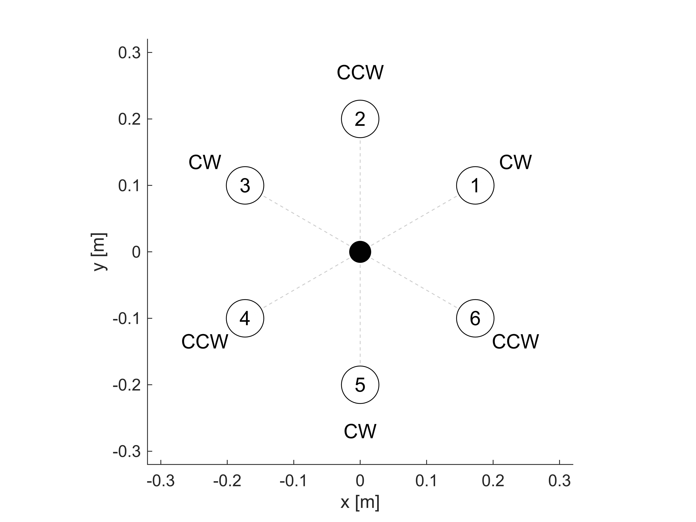
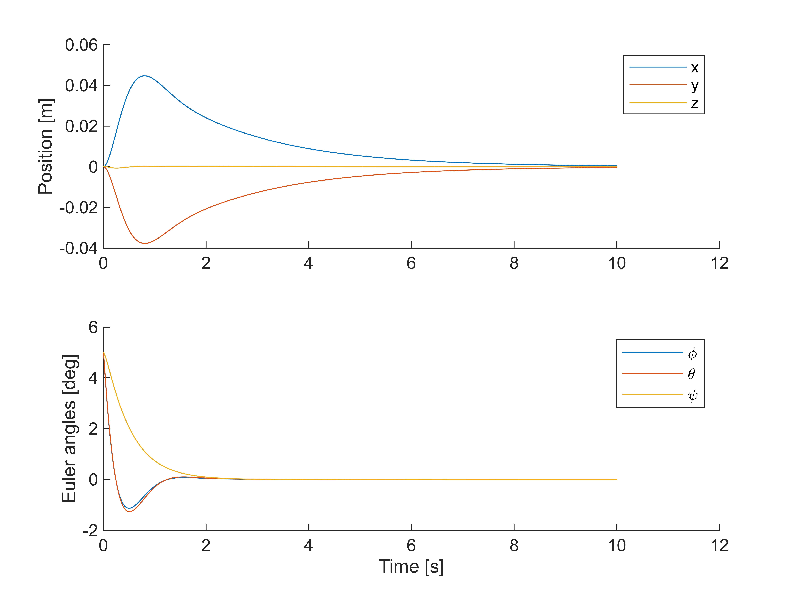
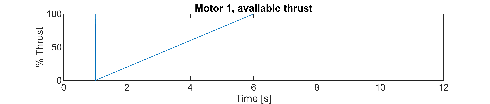
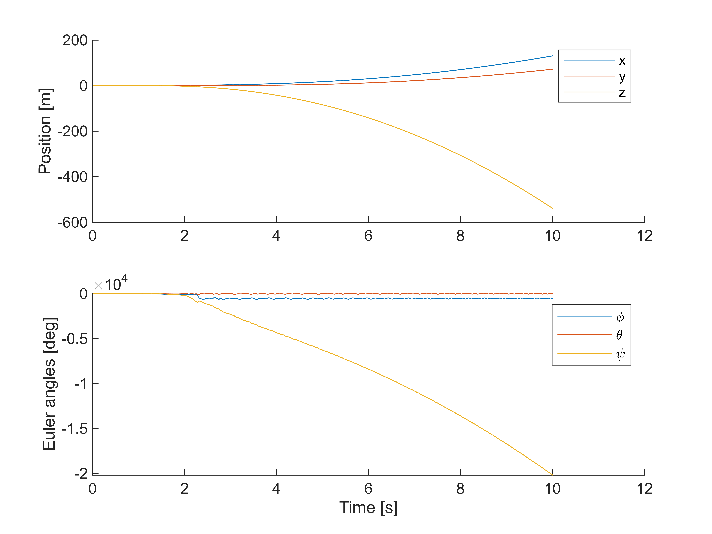
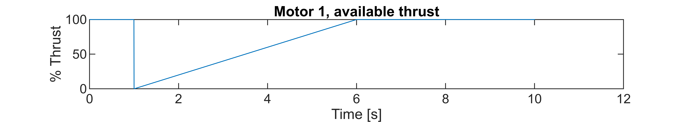
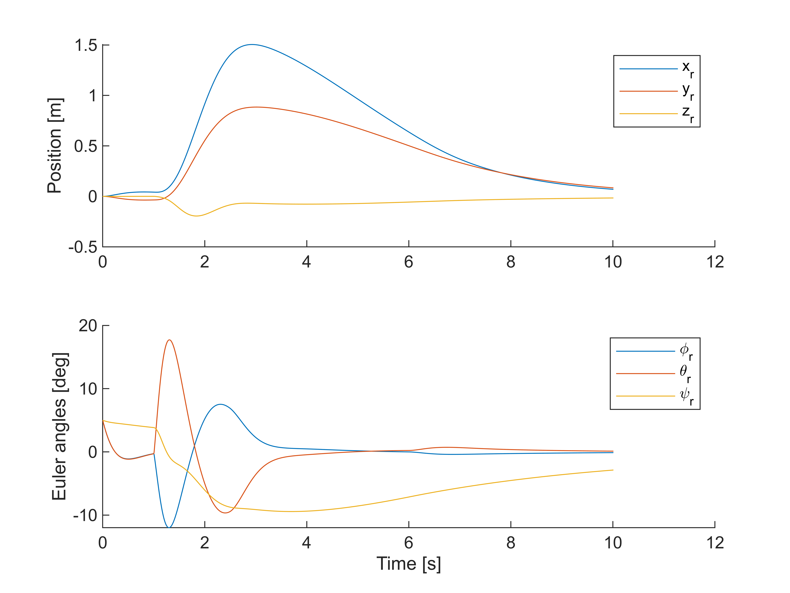
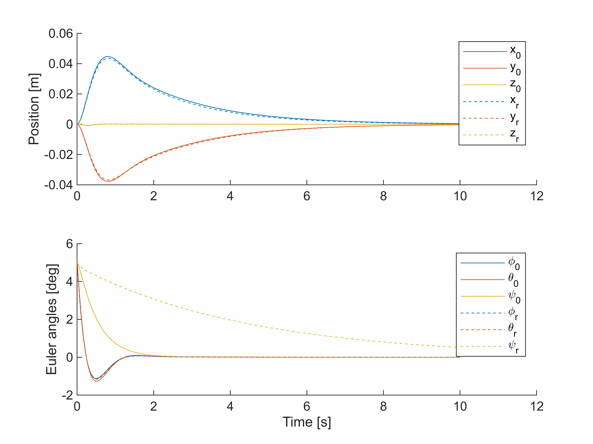

```matlab
clear
close all
setup
load_copter_params
```

# Hexacopter Description

Show the x and y positions for each motor on the hexacopter, and indicate the CCW/CW\-rotating propellers.

```matlab
figure(1); clf; hold on; axis equal
xlabel('x [m]'); ylabel('y [m]')
xlim([-qp.l qp.l]*1.6); ylim([-qp.l qp.l]*1.6);
for i=1:qp.n_rotors
    plot([0 qp.x(i)], [0 qp.y(i)],'--', 'Color',[1 1 1]*0.8)
    scatter(qp.x(i),qp.y(i),512,'MarkerEdgeColor','k','MarkerFaceColor','white')
    if qp.dirs(i) == 1
        label = 'CCW';
    elseif qp.dirs(i) == -1
        label = 'CW';
    end
    text(qp.x(i), qp.y(i), sprintf("%d", i), 'FontSize', 12, 'HorizontalAlignment', 'center', 'VerticalAlignment', 'middle');
    text(qp.x(i)*1.35, qp.y(i)*1.35, sprintf("%s", label), 'FontSize', 12, 'HorizontalAlignment', 'center', 'VerticalAlignment', 'middle');
end
scatter(0,0,2048,'k.')
```


# Nonlinear dynamics.

Each motor is assumed to produce a thrust force according to 

$$
F_i =k_F \omega_i^2
$$

as well as a moment due to air resistance

$$
M_i =\pm k_M \omega_i^2
$$

where the sign of $M_i$ depends on the motor's rotation direction (e.g. if the propeller is rotating CCW, a CW moment will be induced on the copter).


Compactly, this yields the following expression for the total force/torques produced by the motors:


$$
\left\lbrack \begin{array}{c} F_T \\ \tau_x \\ \tau_y \\ \tau_z \end{array}\right\rbrack =M\left\lbrack \begin{array}{c} \omega_1^2 \\ \omega_2^2 \\ \vdots \\ \omega_6^2 \end{array}\right\rbrack
\qquad\text{where}\qquad
M=\left\lbrack \begin{array}{cccc} k_F & k_F & \cdots & k_F \\ k_F (y_1 ) & k_F (y_2 ) & \cdots & k_F (y_6 )\\ k_F (-x_1 ) & k_F (-x_2 ) & \cdots & k_F (-x_6 )\\ k_M & -k_M & \cdots & -k_M \end{array}\right\rbrack
$$


The nonlinear dynamics used to simulate the hexacopter trajectory are the standard equations of motion (Euler's equation + Euler rate dynamics)

$$
{\dot{x} }_I =C_{Ib} v_c
$$

$$
{\dot{v} }_c =-S(\omega )v_c +\frac{1}{m}\left(\left\lbrack \begin{array}{c} 0\\ 0\\ F_t  \end{array}\right\rbrack +C_{bI} \left\lbrack \begin{array}{c} 0\\ 0\\ -mg \end{array}\right\rbrack \right)
$$

$$
\dot{\omega} =-{\mathbb{I}}^{-1} S(\omega )\mathbb{I}\omega +{\mathbb{I}}^{-1} T_c
$$

$$
\left\lbrack \begin{array}{c} \dot{\phi} \\ \dot{\theta} \\ \dot{\psi}  \end{array}\right\rbrack =\left\lbrack \begin{array}{ccc} 1 & \sin \phi \tan \theta  & \cos \phi \tan \theta \\ 0 & \cos \phi  & -\sin \phi \\ 0 & \sin \phi \sec \theta  & \cos \phi \sec \theta  \end{array}\right\rbrack \left\lbrack \begin{array}{c} \phi \\ \theta \\ \psi  \end{array}\right\rbrack
$$

where


&nbsp;&nbsp;&nbsp;&nbsp;&nbsp; ${\dot{x} }_I$ is the hexacopter's xyz position, as measured in the *inertial* frame,


&nbsp;&nbsp;&nbsp;&nbsp;&nbsp; ${\dot{v} }_c$ is the hexacopter's xyz velocity, as measured in the *body* frame,


&nbsp;&nbsp;&nbsp;&nbsp;&nbsp; $\dot{\omega}$ is the hexacopter's angular velocity, as measured in the *body* frame,


&nbsp;&nbsp;&nbsp;&nbsp;&nbsp; $\phi ,\theta ,\psi$ are the Euler angles describing the hexacopter's orientation: the DCM from the inertial frame to the *body* frame is $C_{bI} =C_x (\phi )C_y (\theta )C_z (\psi )$ ,


&nbsp;&nbsp;&nbsp;&nbsp;&nbsp; $F_t$ and $T_C =\left\lbrack \begin{smallmatrix} \tau_x \\ \tau_y \\ \tau_z \end{smallmatrix}\right\rbrack$ describes the force/torques produced by the hexacopter motors, measured in the *body* frame.


Aerodynamic drag on the hexacopter body is not included \- since there are no aerodynamic lifting surfaces, we assume this is negligible.

# Linear dynamics $\dot{x} =Ax+Bu$ .

Linearised about the hover equilibrium, we have


$$
\begin{array}{l} {\dot{x} }_I \approx v_{c_x } \\ {\dot{y} }_I \approx v_{c_y } \\ {\dot{z} }_I \approx v_{c_z } \end{array}
\qquad
\begin{array}{l} {\dot{v} }_{c_x } \approx g\theta \\ {\dot{v} }_{c_y } \approx -g\phi \\ {\dot{v} }_{c_z } \approx \frac{1}{m}\delta_{F_t } \end{array}
\qquad
\begin{array}{l} \dot{\phi} \approx \omega_x \\ \dot{\theta} \approx \omega_y \\ \dot{\psi} \approx \omega_z \end{array}
\qquad
\begin{array}{l} {\dot{\omega} }_x \approx \tau_x /I_{xx} \\ {\dot{\omega} }_y \approx \tau_y /I_{yy} \\ {\dot{\omega} }_z \approx \tau_z /I_{zz} \end{array}
$$


The state space dynamics $\dot{x} =Ax+Bu$ are formed using the state vector


$$
x={\left\lbrack \begin{array}{cccccccccccc} x_I & y_I & z_I & v_{c_x } & v_{c_y } & v_{c_z } & \phi & \theta & \psi & \omega_x & \omega_y & \omega_z \end{array}\right\rbrack }^{\top }
$$

## State matrix $A$ .
```matlab
% Construct A matrix (continuous time)
A = zeros(12);

% Position kinematics
A(1,4) = 1;   % dx/dt = v_c_x
A(2,5) = 1;   % dy/dt = v_c_y
A(3,6) = 1;   % dz/dt = v_c_z

% Translational acceleration
g = 9.81;
A(4,8) =  g;  % ẍ_c ≈  g * theta
A(5,7) = -g;  % ÿ_c ≈ -g * phi

% Angular kinematics
A(7,10) = 1;  % dϕ/dt = ω_x
A(8,11) = 1;  % dθ/dt = ω_y
A(9,12) = 1;  % dψ/dt = ω_z
```
## Input matrix $B$ .
### Linearising the motor mixing matrix $M$ .

Consider the first motor's thrust, $F_1 =k_F \omega_1^2$ . Suppose at equilibrium the motor has rotational velocity ${\bar{\omega} }_1$ .


Then $F_1 \approx k_F {{\bar{\omega} }_1 }^2 +2k_F {\bar{\omega} }_1 \delta_{\omega_1 }$ i.e. $\delta_{F_1 } \approx (2k_F {\bar{\omega} }_1 )\delta_{\omega_1 }$ .


Similarly, $\delta_{M_1 } \approx \pm (2k_M {\bar{\omega} }_1 )\delta_{\omega_1 }$ .


Across all motors for the hexacopter, we end up getting the following linearisation of the motor mixing matrix:


$$
\left\lbrack \begin{array}{c} \delta_{F_T } \\ \delta_{\tau_x } \\ \delta_{\tau_y } \\ \delta_{\tau_z } \end{array}\right\rbrack =M\left\lbrack \begin{array}{c} \delta_{\omega_1 } \\ \delta_{\omega_2 } \\ \vdots \\ \delta_{\omega_6 } \end{array}\right\rbrack
\qquad\text{where}\qquad
M=\left\lbrack \begin{array}{cccc} 2k_F {\bar{\omega} }_1 & 2k_F {\bar{\omega} }_2 & \cdots & 2k_F {\bar{\omega} }_6 \\ 2k_F {\bar{\omega} }_1 y_1 & 2k_F {\bar{\omega} }_2 y_2 & \cdots & 2k_F {\bar{\omega} }_6 y_6 \\ -2k_F {\bar{\omega} }_1 x_1 & -2k_F {\bar{\omega} }_2 x_2 & \cdots & -2k_F {\bar{\omega} }_6 x_6 \\ 2k_M {\bar{\omega} }_1 & -2k_M {\bar{\omega} }_2 & \cdots & -2k_M {\bar{\omega} }_6 \end{array}\right\rbrack
$$ 

### Combining with linear dynamics.
```matlab
% Construct B matrix (continuous time)

% First, compute the linear motor mixing matrix M:
%   [delta_F_T, delta_tau_x, delta_tau_y, delta_tau_z] ~= M * [delta_omega_1; delta_omega_2; ...; delta_omega_6]
enabled = ones(1,6);
omega_bar = compute_omega_bar(qp,enabled);
M = [ ...
        2*qp.kF*omega_bar          .* enabled; ...  % F_t = Σ kF·ω_i² 
        2*qp.kF*omega_bar.*qp.y    .* enabled; ...  % τ_φ = Σ  y_i·(kF·ω_i²) 
       -2*qp.kF*omega_bar.*qp.x    .* enabled; ...  % τ_θ = Σ –x_i·(kF·ω_i²) 
       -2*qp.kM*omega_bar.*qp.dirs .* enabled; ...  % τ_ψ = Σ (±1)·(kM·ω_i²) 
];
B = zeros(12,qp.n_rotors);
B(6,:)  = (1/qp.m)    * M(1,:);  % z_c_ddot = F_t / m
B(10,:) = (1/qp.I_xx) * M(2,:);  % ω_x_dot  = τ_x / I_xx
B(11,:) = (1/qp.I_yy) * M(3,:);  % ω_y_dot  = τ_y / I_yy
B(12,:) = (1/qp.I_zz) * M(4,:);  % ω_z_dot  = τ_z / I_zz
```

# Design an LQR controller.

Assume we can implement a discrete time controller with an update frequency of 100Hz.

```matlab
qp.Ts = 1/100;
```

Use Bryson's rule to determine the cost matrices $Q,R$ . Recall the state vector ordering is

$$
x={\left\lbrack \begin{array}{cccccccccccc} x_I & y_I & z_I & v_{c_x } & v_{c_y } & v_{c_z } & \phi & \theta & \psi & \omega_x & \omega_y & \omega_z \end{array}\right\rbrack }^{\top }
$$

```matlab
max_allowable_x = [[10 10 10]*0.01, ...  % Allowable xyz displacement, around 10cm
                   [5 5 5]*0.01, ...     % Allowable xyz velocities, around 5cm/s
                   deg2rad([5 5 5]), ... % Allowable Euler angles, around 5deg
                   deg2rad([5 5 10])];   % Allowable Euler rates, around 5 to 10deg/s

qp.nominal_omegas = compute_omega_bar(qp, ones(1,qp.n_rotors), 'least_squares');
max_omegas = ones(1,qp.n_rotors) * qp.max_RPM*2*pi/60;
max_delta_omegas = max_omegas - qp.nominal_omegas;
max_allowable_u = max_delta_omegas; % Allowable change in RPM: as determined by the copter's RPM headroom

Q = diag(1 ./ max_allowable_x.^2);
R = diag(1 ./ max_allowable_u.^2);
```

Now design the nominal LQR controller, $K_0$ .

```matlab
A_cts = get_A_matrix(); B_cts = get_B_matrix(qp);
sys_d = c2d(ss(A_cts, B_cts, eye(12), 0), qp.Ts, 'zoh');

K0 = dlqr(sys_d.A, sys_d.B, Q, R); % Nominal controller for closed loop dynamics A+BK (not A-BK as dlqr() assumes)
```
# Simulate the closed loop dynamics (nonlinear model with nominal controller $K_0$ ).

Let's test the hexacopter's response to a small initial condition — all Euler angles at 5 degrees, zero ICs for everything else.

```matlab
% Assess the LQR controller based on nominal model
qp.K = K0;
x0 = [0 0 0 0 0 0 deg2rad([5 5 5]) 0 0 0]';

% Define the function describing available thrust from motors 1-6
thrust_fcn = @(t) ones(1,qp.n_rotors); % all motors operating normally

% Run the simulation
tspan = [0 10];
[t,X] = run_sim(qp, tspan, x0, thrust_fcn);

% Draw plots
figure; clf
plot_trajectories({t},{X})
subplot(2,1,1); legend('x','y','z')
subplot(2,1,2); legend('\phi','\theta','\psi')
```



The closed\-loop response is satisfactory — position steadily recovers, while attitude and altitude both seem well\-regulated, responsively mitigating the disturbance.


We will use these $Q$ and $R$ matrices throughout the remainder the design.

# Simulate the dynamics under motor failure (nonlinear model, nominal controller $K_0$ ).

Now, consider partial or full loss of thrust in Motor 1. Instead of $F_1 =k_F \omega_1^2$ , suppose we now have

$$
F_1 =ck_F \omega_1^2
$$

where $c\in [0,1]$ determines the percentage of available thrust. For example:


&nbsp;&nbsp;&nbsp;&nbsp;&nbsp; $c=0$ indicates complete loss of thrust  — the motor has completely failed — or


&nbsp;&nbsp;&nbsp;&nbsp;&nbsp; $c=0.5$ represents 50% available thrust — the coefficient of thrust has been reduced to half its original value — e.g. a collision has partially destroyed a propeller.


In the following simulation, we simulate the hexacopter's nonlinear dynamics assuming Motor 1 has thrust loss as follows:

$$
0\le t<1~~\to c=1.0
$$

$$
1\le t<6~~\to c=\frac{(t-1)}{5}
$$

$$
t\ge 6~~\to c=1.0
$$

i.e. thrust is completely loss at $t=1$ seconds, and linearly comes back online over the next 5 seconds.


While LQR controllers have good robustness, the dynamics under motor failure are significantly different from those assumed during design, and the hexacopter ends up destabilising:

```matlab
% Assess the LQR controller based on nominal model
qp.K = K0;

% Define the function describing Motor 1's available thrust
t_disturb = 1;
recover_t = 5;
c = @(t) ...
    (t < t_disturb) .* 1 + ...
    (t >= t_disturb & t < t_disturb+recover_t) .* ((t-t_disturb)/recover_t) + ... % recover linearly from c=0 to c=1
    (t >= t_disturb+recover_t) .* 1;
thrust_fcn = @(t) [c(t) 1 1 1 1 1];

% We'll plot this function below for clarity
f = figure; clf
set(f, 'Position', [680 458 560 120])
plot(t, c(t)*100)
xlabel('Time [s]'); ylabel('% Thrust'); title('Motor 1, available thrust')
```



```matlab
% Run the simulation
tspan = [0 10];
x0 = zeros(12,1);
[t,X] = run_sim(qp, tspan, x0, thrust_fcn);

% Plot the hexacopter's trajectory
figure; clf
plot_trajectories({t},{X})
subplot(2,1,1); legend('x','y','z')
subplot(2,1,2); legend('\phi','\theta','\psi')
```



LQR is optimal (with respect to its design parameters) and generally has strong robustness properties — but when disturbances and parametric uncertainties are significant enough, closed\-loop stability will break.


In our case, motor failure yields an unexpected null column in the system's $B$ matrix — this is a parametric uncertainty that we can robustify against during design, using Guaranteed Cost Control (GCC).


Guaranteed Cost Control (GCC) extends the idea of LQR to systems with parametric uncertainty, minimising the LQR cost and taking into account the full uncertainty polytope during synthesis, thus buying robustness to the parametric uncertainty (or giving you a concrete answer, telling you that it's impossible :P).

# Design new robust LQR controller $K_r$ , considering possible motor failure.

Using the LMI proposed in (Oliveira, 2002), we can redesign the LQR controller to work across all scenarios — nominal dynamics, along with the six motor\-failure cases:

```matlab
% Define scenarios
pct = 0.0;
scenarios = {
    [1 1 1 1 1 1], ... % All motors working normally
    [pct 1 1 1 1 1], ... % Loss of thrust in Motor 1
    [1 pct 1 1 1 1], ... % Loss of thrust in Motor 2
    [1 1 pct 1 1 1], ... % .
    [1 1 1 pct 1 1], ... % .
    [1 1 1 1 pct 1], ... % .
    [1 1 1 1 1 pct]  ... % Loss of thrust in Motor 6
};

N = length(scenarios);
A_d_set = cell(1,N);
B_d_set = cell(1,N);
for i=1:N
    % Continuous time dynamics
    A_cts = get_A_matrix();
    B_cts = get_B_matrix(qp, scenarios{i}, 'keep_opposite_motor_at_nominal_RPM');

    % Convert to discrete-time and store results
    sys_d = c2d(ss(A_cts, B_cts, eye(12), 0), qp.Ts, 'zoh');
    A_d_set{i} = sys_d.A;
    B_d_set{i} = sys_d.B;
end

% Using the set of discrete-time (A,B) matrices, solve the LMI and find the robust controller Kr
Kr = dlqr_multiplant(A_d_set, B_d_set, Q, R); % Robust controller
```
# Test the robust LQR controller $K_r$ (under motor failure)
```matlab
% Demonstrate the thrust failure condition
f = figure; clf
set(f, 'Position', [680 458 560 100])
plot(t, c(t)*100)
xlabel('Time [s]'); ylabel('% Thrust'); title('Motor 1, available thrust')
```



```matlab
% Run the simulations
x0 = [0 0 0 0 0 0 deg2rad([5 5 5]) 0 0 0]';
tspan = [0 10];
qp.K = Kr; [tr,Xr] = run_sim(qp, tspan, x0, @(t) [c(t) 1 1 1 1 1]);

% Plot hexacopter trajectory, using K0 vs Kr
figure; clf
plot_trajectories({tr},{Xr})
subplot(2,1,1); legend('x_r','y_r','z_r')
subplot(2,1,2); legend('\phi_r','\theta_r','\psi_r')
```



With the new controller $K_r$ , the hexacopter is able to safely recover from the thrust\-loss disturbance.

# Test the robust LQR controller $K_r$ (under nominal conditions)

Further, the nominal performance is similar to $K_0$ 

```matlab
thrust_fcn = @(t) [1, 1, 1, 1, 1, 1]; % All motors working normally

% Run the simulations
x0 = [0 0 0 0 0 0 deg2rad([5 5 5]) 0 0 0]';
tspan = [0 10];
qp.K = K0; [t0,X0] = run_sim(qp, tspan, x0, thrust_fcn);
qp.K = Kr; [tr,Xr] = run_sim(qp, tspan, x0, thrust_fcn);

% Plot hexacopter trajectory, using K0 vs Kr
figure; clf
plot_trajectories({t0,tr},{X0,Xr})
subplot(2,1,1); legend('x_0','y_0','z_0','x_r','y_r','z_r')
subplot(2,1,2); legend('\phi_0','\theta_0','\psi_0','\phi_r','\theta_r','\psi_r')
```



Under nominal conditions, the closed\-loop responses under $K_r$ (solid lines) and $K_0$ (dashed lines) are  *almost* identical — the robust gain purchased stability, with minimal performance impact under nominal conditions.


The exception is yaw, $\psi$ . Gramian analysis (finite\-horizon) shows the yaw mode is weakly controllable on the nominal plant — a consequence of the hexacopter geometry (yaw authority comes from differential thrust between counter\-rotating pairs, which is a weaker mechanism than the direct moment arms driving pitch and roll), and something that's only exacerbated under motor loss.


The LQR cost — a $H_2$ norm — is an expected cost, averaged across states; in contrast, the $H_{\infty }$ norm is adversarial and targets worst\-case metrics, naturally protecting against disturbances that amplify the modes with weakest controllability. A $H_{\infty }$ constraint on the attitude output, applied across the uncertainty set, would directly target the yaw mode by bounding worst\-case disturbance amplification in exactly the channel where controllability is weakest, so future work should consider a mixed $H_2$ / $H_{\infty }$ synthesis.

# Conclusion.

`dlqr_multiplant` is essentially `dlqr` for the multiplant case — it finds a single state\-feedback gain that minimises a guaranteed $H_2$ cost across a set of plants, rather than a single nominal model. The underlying LMI is a standard result (de Oliveira et al., 2002), but such results, and working MATLAB implementations, aren't always easy to find; the hope is that the code here is useful as a starting point for others facing similar robust control problems.


Applied to the hexacopter, the result is a passive fault\-tolerant controller — no fault detection, no switching, one gain — that stabilises the vehicle under complete single\-motor loss with near\-nominal performance in all channels but yaw, where the physical limits of the actuator geometry dominate. Whether the motor is healthy or dead, the same 6x12 matrix closes the loop. The complexity is absorbed entirely at design time; all that remains to implement is matrix multiplies on a microcontroller.


The yaw limitation here is worth acknowledging and investigating in future work: the Gramian shows the structural problem, and in hindsight the robust $H_2$ objective makes the correct average\-case decision given that geometry. The mixed $H_2$ / $H_{\infty }$ extension doesn't change the underlying physics, but it would let you target it more deliberately during synthesis.

